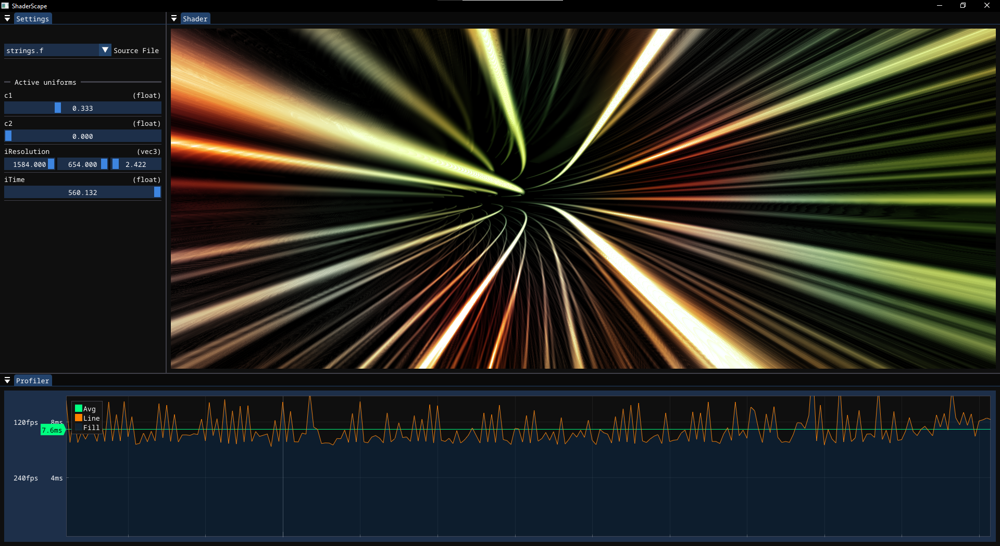
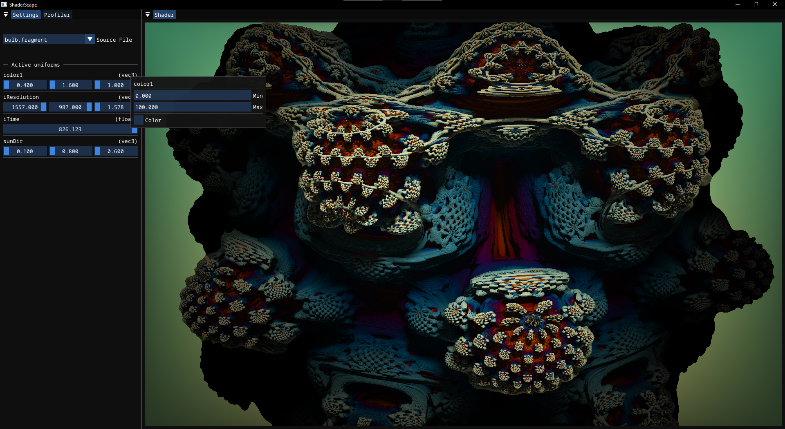

# Shader Scape
Shader Scape is a shader toy like program that lets you live edit glsl shaders. Designed with ease of exploration in mind, uniforms are displayed as widgets for real time editing of colors and constants vectors and matrices and shaders are reloaded when the file is saved to disk.

Shader files live in the `Shaders/` directory and currently only fragment shaders are supported. 

## Features
- Load fragment shaders
- Uniforms editable via widgets, updated live
- Profile shader performance
- Built in uniforms (more to come)

## Future
- More builtin uniforms
- GLSL text editor
- Image buffers and channels
- Multi file shaders

## Dependencies
[Premake](https://github.com/premake/premake-core)
[glfw](https://github.com/glfw/glfw)
[glm](https://github.com/g-truc/glm)
[ImGui](https://github.com/ocornut/imgui)
[ImPlot](https://github.com/epezent/implot)

## License
- UNLICENSE for this repository (see `UNLICENSE.txt` for more details)
- Premake is licensed under BSD 3-Clause (see included LICENSE.txt file for more details)
